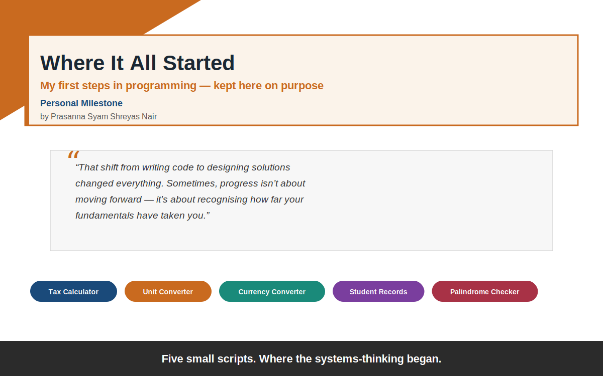
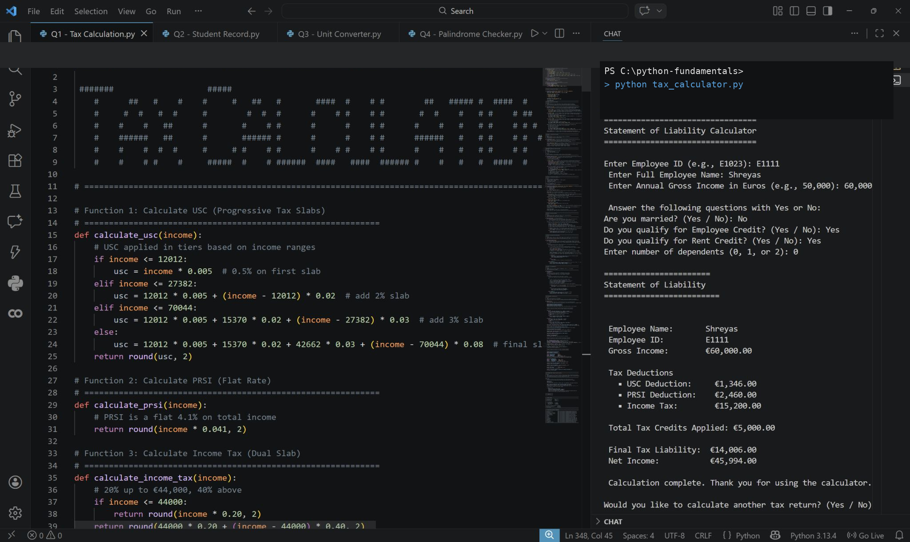

# Where It All Started

## Why this is here

These five scripts are intentionally basic. A tax calculator, a unit converter, a currency converter, a student record system, a palindrome checker — nothing here is meant to show off advanced skill. It's the opposite: this repo stays exactly as simple as it started.

Revisiting these reminded me why I got into Business Analytics and Python in the first place. Modelling a real tax system, managing structured records, converting units, checking patterns — these weren't just exercises. They were my first exposure to thinking in systems: breaking a problem into logic, handling edge cases, validating inputs, making sure the output could actually be trusted.

That shift — from writing code to designing solutions — is what shaped how I approach problem-solving, scalability, and clarity in analytics today. So this repo isn't here to impress. It's here as a marker of where that started, and a reminder that progress isn't always about moving forward — sometimes it's about recognising how far your fundamentals have taken you.

## The scripts

| Script | What it does |
|---|---|
| `tax_calculator.py` | Calculates USC, PRSI, and Income Tax liability based on Irish tax bands, applying credits to produce a clean tax statement |
| `student_record.py` | A student record management system — storing, updating, and querying student data |
| `unit_converter.py` | Converts between common units (length, weight, temperature, etc.) |
| `currency_converter.py` | Converts between currencies using exchange rates |
| `palindrome_checker.py` | Checks whether a given string or number is a palindrome |

`tax_calculator.py` running in VS Code, generating a full Statement of Liability from user input:

## Tech
Pure Python, no external dependencies — each script runs standalone.

<!-- last reviewed: 2026-09 -->
